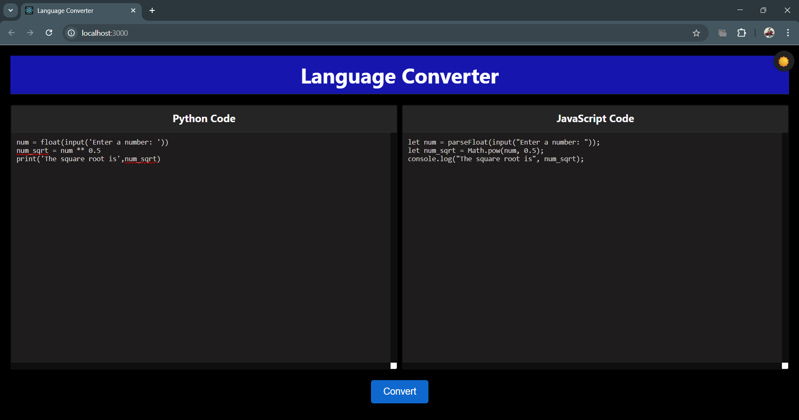
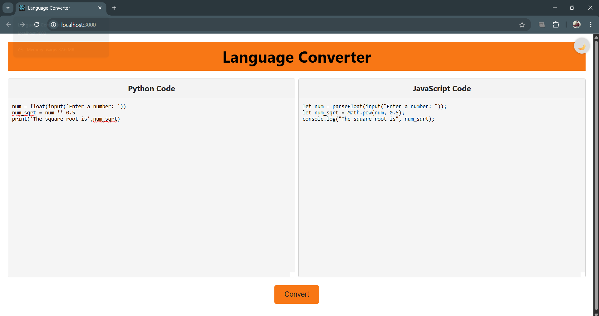

# PBL_CD_Language_Translator
Compiler Design 

This project is a compiler design project that converts Python code to JavaScript code. It uses a Flask API to handle the conversion and a React frontend to display the results.
First the python code is passed through a lexical analyzer to break it down into tokens. Then the tokens are passed through a parser to generate an intermediate representation (IR). Finally, the IR is passed through a code generator to generate JavaScript code. Direct AST-based transpilation from Python to JavaScript.

## Installation and Setup

### Prerequisites
- Python 3.8 or higher
- Node.js 14 or higher
- npm 6 or higher

### Backend Setup
1. Clone the repository
   ```
   git clone https://github.com/Mokshitajoshi/PBL_CD_Language_Translator.git
   ```

2. Create and activate a virtual environment (optional but recommended)
   ```
   python -m venv venv
   .venv\Scripts\activate

3. Install backend dependencies(only for the first time)
   ```
   pip install -r requirements.txt
   ```

4. Start the Flask API
   ```
   cd phase1
   python app.py
   ```
   The API will run on http://127.0.0.1:5000

### Frontend Setup
1. Open a new terminal window/tab
2. Navigate to the frontend directory
   ```
   cd frontend
   ```

3. Install frontend dependencies (only for the first time)
   ```
   npm install
   ```

4. Start the React development server
   ```
   npm start
   ```
   The frontend will run on http://localhost:3000

## How to Use
1. Make sure both the Flask API and React frontend are running
2. Open your browser and navigate to http://localhost:3000
3. Enter Python code in the left panel
4. Click the "Convert" button
5. The JavaScript code will be displayed in the right panel

## Features:
1. Lexical Analyzer
2. Parser
3. Code Generator
4. Flask API
5. React Frontend

## Can Convert Elements
1. Functions
2. Loops
3. Variables
4. Conditionals
5. Expressions

## Future Features:
1. More robust error handling
2. More complex code generation
3. More languages

## Screenshots

### Translator Interface 

*Example of how the the translator opens at start.*

### Dark Mode Interface

*The application in dark mode, showing Python code on the left and converted JavaScript on the right.*

### Light Mode Interface

*The application in light mode, with a simple Python function being converted.*


